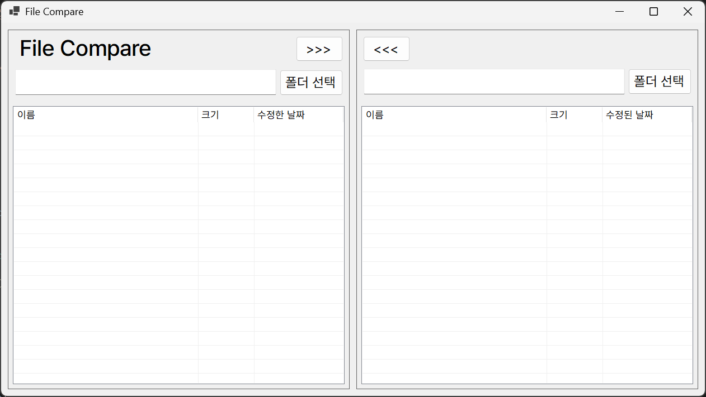
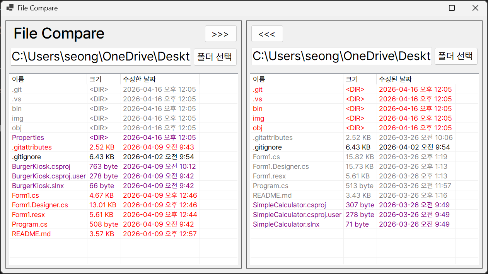
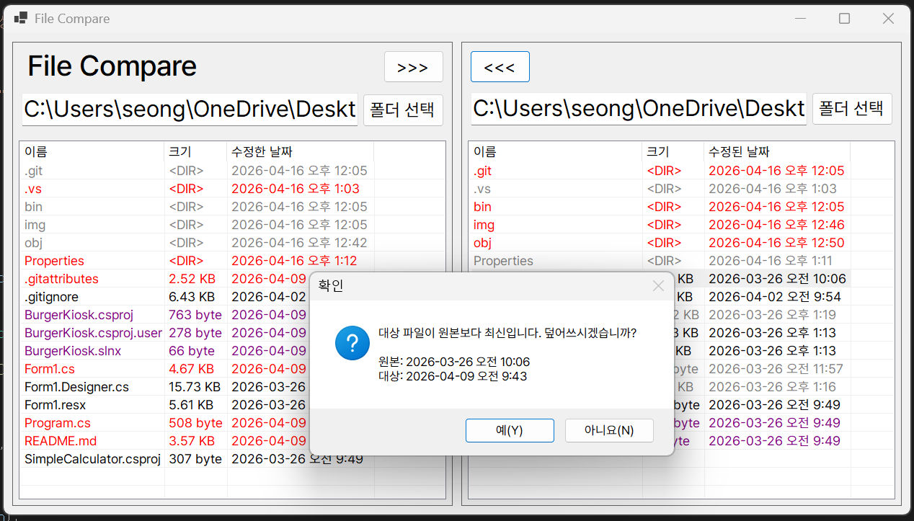
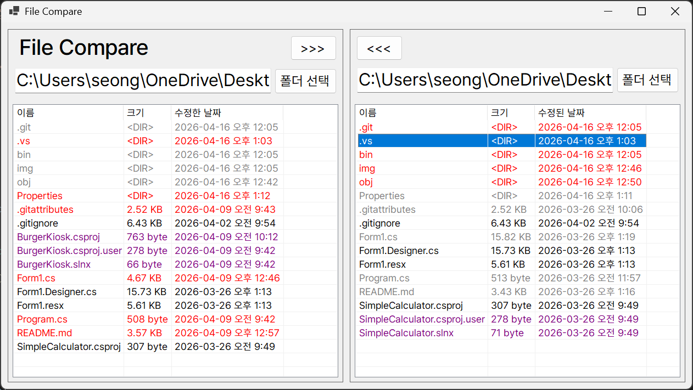

# 7주차 과제: 파일 비교기

## 개요
- C# 프로그래밍 학습
- 1줄 소개: 양쪽 폴더를 불러와 파일/디렉터리를 이름과 수정 시간으로 비교하고 색상으로 차이를 표시하며, 파일/폴더 복사(덮어쓰기 경고 포함)를 지원하는 앱
- 사용한 플랫폼:
    - C#, .NET Windows Forms, Visual Studio, Github
- 사용한 컨트롤:
    - SplitContainer, Panel, Label, TextBox, Button, ListView, FolderBrowserDialog
- 사용한 기술과 구현한 기능
    - 좌/우 패널로 구분된 SplitContainer 기반 레이아웃, 상단은 타이틀/폴더선택 영역을 별도 Panel로 분리
    - FolderBrowserDialog로 폴더 선택 후 PopulateListView로 목록 표시
    - 디렉터리는 DirectoryInfo, 파일은 FileInfo를 사용해 판별과 비교에 사용
    - 이름(대소문자 무시)과 LastWriteTime으로 비교
    - 색상 규칙:
        - 완전히 동일(이름 + 수정시간 동일): 검은색
        - 이름 동일, 수정시간이 더 최신인 쪽: 빨간색, 상대는 회색
        - 한쪽에만 존재(이름 겹치지 않음): 보라색
    - 선택한 파일을 다른 쪽 폴더로 복사, 대상이 더 최신이면 날짜를 보여주며 덮어쓰기 확인
    - 하위 폴더 포함 재귀 복사(덮어쓰기), 복사 전에 대상에서 소스보다 더 최신인 파일 있는지 검사하여 사용자 확인
    - 복사 후 목록 갱신 및 재비교 자동 수행

## 실행 화면 (과제1)
- 과제1 코드의 실행 스크린샷

- 과제 내용
    - UI 구성
        - GUI 배치
        - 컨트롤 배치
    - 컨트롤의 기본 기능 확인과 구현

- 구현 내용과 기능 설명
    - SplitContainer로 좌/우 패널 구분, 상단은 타이틀과 폴더 선택 영역으로 별도 Panel로 구성하여 레이아웃 구현

## 실행 화면 (과제2)
- 과제2 코드의 실행 스크린샷

- 과제 내용
    - 폴더 선택 기능과 파일 리스트 기능 구현
    - 양쪽 폴더의 파일 표시

- 구현 내용과 기능 설명
    - CompareListViews() 구현:
        - 각 ListView의 항목을 이름 기준으로 맵으로 변환 후 합집합 이름 목록 생성
        - 동일 이름 존재 시 Tag에 있는 LastWriteTime으로 비교하여 ForeColor 설정
    - 색상 규칙 구현:
        - 동일: Color.Black
        - 소스가 더 최신: Color.Red, 상대 Color.Gray
        - 한 쪽에만 존재: Color.Purple

## 실행 화면 (과제3)
- 과제3 코드의 실행 스크린샷

- 과제 내용
    - 양쪽 폴더 사이에서 파일의 복사 기능 구현
        - 서택한 파일을 반대쪽 폴더로 복사하기
        - 수정된 날짜 정보를 확인해서 "확인" 받아 진행여부 결정하기

- 구현 내용과 기능 설명
    - 선택한 파일을 File.Copy로 복사, 대상이 더 최신인 경우 MessageBox로 날짜를 보여주며 덮어쓰기 확인

## 실행 화면 (과제4)
- 과제4 코드의 실행 스크린샷

- 과제 내용
    - 하위폴더에 대해서 한 방에 비교, 복사가 가능하도록 개선
        - 하위폴더를 하나의 파일처럼 처리
        - 적절하게 색상 표시
        - 뵥사 버튼 누르면 하위폴더의 모든 내용 (파일과 하위폴더 포함) 처리

- 구현 내용과 기능 설명
    - 디렉터리 복사 흐름
        - DirectoryCopy(sourceDir, destDir, overwrite) — 재귀적으로 디렉터리 생성 및 파일 복사
        - FindDestinationNewerFiles(srcDir, dstDir) — 소스 기준으로 대상에서 더 최신인 파일 목록을 수집
        - 대상에 더 최신 파일이 하나라도 있으면 갯수와 예시 파일명을 표시한 확인 대화상자 표시
        - 사용자가 확인하면 DirectoryCopy로 재귀 복사(파일 덮어쓰기 허용)
        - 복사 완료 후 대상 루트 목록 갱신 및 재비교 수행
    - 예외 처리: IOException, UnauthorizedAccessException 등 처리

## 배운 내용
- ListViewItem.Tag에 FileInfo/DirectoryInfo 저장 후 타입 패턴(`is`)으로 파일/폴더 판별하는 패턴을 배웠음
- 파일/폴더의 LastWriteTime으로 동기화/충돌 검출 로직 구현
- 재귀적 디렉터리 복사 구현과 덮어쓰기 전 사용자 확인 흐름 구현
- UI 레이아웃: SplitContainer와 여러 Panel 조합으로 상단 타이틀/폴더선택 영역 분리하여 깔끔한 레이아웃 구성